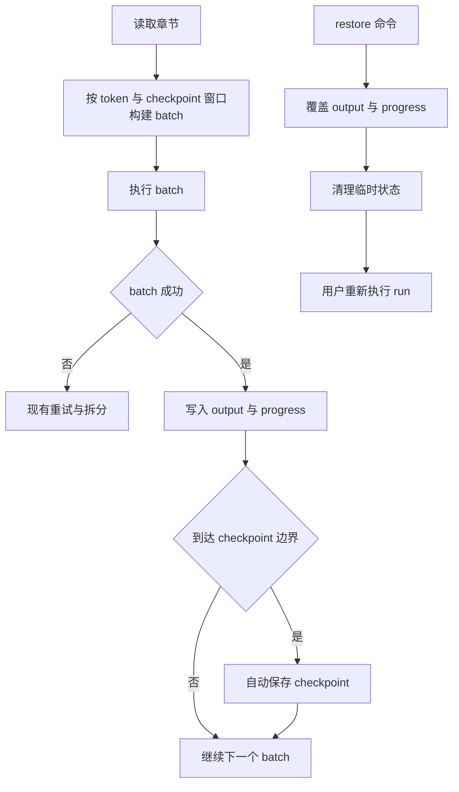

# Checkpoint 自动保存与恢复方案

## 目标

在现有批处理流程中加入 checkpoint 自动保存能力，满足以下约束：

- 每处理到固定章节边界时自动保存 checkpoint
- 单个 [`ChapterBatch`](src/models.py:20) 不能跨越 checkpoint 窗口边界
- checkpoint 仅保存恢复运行所需的 `output` 与 `state`
- 恢复通过新增命令完成，恢复后由用户重新执行 [`run`](src/app.py:223)
- 不把当前系统改造成复杂的阶段提交或自动回滚状态机

## 现有实现观察

### 运行主流程

- 任务主入口在 [`TaskRunner.run_task()`](src/task_runner.py:63)
- 初始批次构建在 [`TaskRunner._build_initial_batches()`](src/task_runner.py:109)
- 单批次执行在 [`TaskRunner._run_batch()`](src/task_runner.py:213)
- 失败后拆分批次在 [`TaskRunner._run_batch_tree()`](src/task_runner.py:158)
- 进度文件初始化与更新在 [`ProgressStore`](src/progress_store.py:12)

### 现状问题

当前系统虽然会持续写入 progress，但缺少可显式恢复的历史快照：

- 输出在 [`TaskRunner._run_batch()`](src/task_runner.py:324) 合并后立即写入 [`output_path`](src/task_runner.py:325)
- 进度在 [`ProgressStore.mark_batch_completed()`](src/progress_store.py:140) 后立即保存
- batch 只受 token budget 约束，见 [`TaskRunner._build_initial_batches()`](src/task_runner.py:116)
- 因此可能出现一个 batch 跨越多个章节窗口，一旦后续数据写坏，无法方便地回退到较早稳定点

## 需求边界

### 本方案包含

- 在当前处理流程中插入自动 checkpoint 保存
- 用固定章节窗口限制 batch 边界
- 提供手动 restore 命令恢复 `output` 与 `progress`
- 恢复后重新运行现有 [`run`](src/app.py:223)

### 本方案不包含

- 运行失败时自动回滚到 checkpoint
- 把整个任务切成必须手动确认的阶段提交流程
- 恢复日志、debug 响应、stream buffer 的历史内容

## 设计总览



## 配置设计

建议在 [`BatchingConfig`](src/models.py:229) 增加以下字段：

- `enable_checkpoint: bool = False`
- `checkpoint_every_n_chapters: int = 10`

说明：

- `enable_checkpoint=false` 时保持现有行为
- `checkpoint_every_n_chapters<=0` 视为关闭 checkpoint 窗口限制
- checkpoint 窗口大小与自动保存边界共用同一个值，避免双重配置

同时同步修改：

- [`load_config()`](src/app.py:34)
- [`default_raw_config()`](src/app.py:91)
- [`config.example.yaml`](config.example.yaml)

建议配置示例：

```yaml
batching:
  enable_multi_chapter: true
  max_input_tokens: 12000
  prompt_overhead_tokens: 1500
  reserve_output_tokens: 3000
  allow_oversize_single_chapter: true
  split_on_failure: true
  split_after_retry_exhausted: true
  enable_checkpoint: true
  checkpoint_every_n_chapters: 10
```

## Checkpoint 存储布局

建议把 checkpoint 放到工作区根下的独立目录，而不是继续挂在当前 `state` 目录内部。

路径约束按你补充的结构定义：

- `workspace/*/checkpoint/*/state/`
- `workspace/*/checkpoint/*/output/`

其中可解释为：

- 第一个 `*`：某个 EPUB 对应的工作区目录
- 第二个 `*`：某个 checkpoint id，例如 `ch0010`

### 建议目录结构

```text
workspace/<epub>/
  checkpoint/
    ch0010/
      state/
        characters.progress.yaml
        meta.yaml
      output/
        characters.yaml
    ch0020/
      state/
        characters.progress.yaml
        meta.yaml
      output/
        characters.yaml
```

### 文件说明

- `state/`：保存该 checkpoint 时刻的 progress 快照与 checkpoint 元数据
- `output/`：保存该 checkpoint 时刻的 schema 输出快照
- `meta.yaml`：记录 checkpoint id、章节边界、schema 名称、保存时间等信息

### 命名规则

checkpoint id 建议与章节边界一致，例如：

- `ch0010`
- `ch0020`
- `ch0130`

这样能够直接表达 截止到第几章 的稳定状态。

## 运行时设计

### 1. batch 不能跨 checkpoint 窗口

核心改动点在 [`TaskRunner._build_initial_batches()`](src/task_runner.py:109)。

当前逻辑只判断 token budget，后续应增加窗口约束：

- 根据章节编号计算当前章节所属窗口
- 若待加入章节与 `pending` 中首章不属于同一窗口，则先结束当前 batch
- 再重新开始下一个 batch

### 窗口计算建议

若 `N = checkpoint_every_n_chapters`，则：

- 第 `1..N` 章属于窗口 1
- 第 `N+1..2N` 章属于窗口 2
- 以此类推

可抽成辅助函数，示意：

- `window_index = (chapter_index - 1) // N`
- `window_end = ((window_index + 1) * N)`

### 举例

当 `N=10`：

- 第 8、9、10 章可进入同一 batch
- 第 10 章和第 11 章即使 token 仍够，也必须拆开

### 2. oversize 单章兼容

[`TaskRunner._build_initial_batches()`](src/task_runner.py:126) 当前允许超大单章独立成 batch。

该逻辑可以保留，因为单章 batch 天然不会跨越 checkpoint 窗口。

### 3. 失败拆分兼容

[`TaskRunner._run_batch_tree()`](src/task_runner.py:158) 依赖 [`ChapterBatch.split()`](src/models.py:60) 把原 batch 拆成左右子批次。

只要初始 batch 已被窗口边界限制，子批次一定仍留在原窗口中，因此无需对拆分机制做额外窗口裁剪。

## 自动保存时机

建议在 [`TaskRunner._run_batch()`](src/task_runner.py:213) 成功完成以下步骤后判定是否保存 checkpoint：

- merge 成功，见 [`TaskRunner._run_batch()`](src/task_runner.py:324)
- 调用 [`ProgressStore.mark_batch_completed()`](src/progress_store.py:140)
- 调用 [`self.progress_store.save()`](src/task_runner.py:337)

然后增加逻辑：

- 若 `last_completed_chapter_index % checkpoint_every_n_chapters == 0`
- 或 `last_completed_chapter_index == total_chapters`
- 则自动生成 checkpoint

### 保存顺序建议

1. 先写当前 output
2. 先写当前 progress
3. 再复制这两个文件到 checkpoint 目录
4. 最后刷新 `latest.yaml`

这样 checkpoint 一定对应一个已经成功持久化的稳定状态。

## 恢复命令设计

建议在 [`app.py`](src/app.py) 增加 restore 子命令，而不是改造正常运行入口。

### 建议 CLI 形式

```text
python src/app.py restore --epub input/book.epub --schema schemas/characters.yaml --checkpoint ch0010
```

可选支持：

```text
python src/app.py restore --epub input/book.epub --schema schemas/characters.yaml --latest
```

### restore 流程

1. 根据 `epub + schema` 定位工作区
2. 找到目标 checkpoint 目录
3. 用 checkpoint 中的 `output.yaml` 覆盖当前 output
4. 用 checkpoint 中的 `progress.yaml` 覆盖当前 progress
5. 清理当前 [`stream_buffer_path`](src/task_runner.py:58)
6. 在 progress 中记录最近 restore 来源
7. 退出命令，不自动继续运行

之后用户再执行 [`run`](src/app.py:223)，系统按恢复后的 progress 继续。

## Progress 扩展设计

不建议把 progress 扩展成复杂状态机，只补充轻量 checkpoint 元数据。

建议在 [`ProgressStore.initialize()`](src/progress_store.py:24) 中新增：

```yaml
checkpoint:
  enabled: false
  every_n_chapters: 0
  last_saved_id: ""
  last_saved_chapter_index: 0
  last_restored_id: ""
  last_restored_at: ""
```

后续在自动保存与 restore 时维护这些字段即可。

### 维护规则

- 初始化时写入配置值
- 自动保存 checkpoint 后更新 `last_saved_id` 与 `last_saved_chapter_index`
- restore 后更新 `last_restored_id` 与 `last_restored_at`

## 组件建议

建议新增一个 checkpoint 存储组件，例如：

- `src/checkpoint_store.py`

职责：

- 根据 [`TaskDefinition`](src/models.py:264) 与 schema 定位 checkpoint 目录
- 保存 checkpoint 快照
- 列出可用 checkpoint
- 加载指定 checkpoint
- 执行 restore 覆盖
- 维护 latest 指针

这样可以避免把 checkpoint 文件操作堆进 [`TaskRunner`](src/task_runner.py:20) 或 [`app.py`](src/app.py:1)。

## 影响点清单

### 配置与模型

- [`BatchingConfig`](src/models.py:229)
- [`AppConfig`](src/models.py:243) 只需复用现有 `batching`
- [`load_config()`](src/app.py:34)
- [`default_raw_config()`](src/app.py:91)
- [`config.example.yaml`](config.example.yaml)

### 工作区与存储

- [`WorkspacePaths`](src/models.py:77)
- 新增 [`checkpoint_store.py`](src/checkpoint_store.py)

### 运行逻辑

- [`TaskRunner._build_initial_batches()`](src/task_runner.py:109)
- [`TaskRunner._run_batch()`](src/task_runner.py:213)
- 可能需要在 [`TaskRunner.__init__()`](src/task_runner.py:21) 注入 checkpoint store

### 命令行入口

- [`build_parser()`](src/app.py:200)
- [`main()`](src/app.py:218)
- 新增 restore command handler 于 [`app.py`](src/app.py)

### 进度模型

- [`ProgressStore.initialize()`](src/progress_store.py:24)
- 新增 checkpoint 更新方法到 [`ProgressStore`](src/progress_store.py:12)

### 测试

- [`tests/test_pipeline.py`](tests/test_pipeline.py)

## 测试方案

至少覆盖以下场景：

### 1. batch 不跨窗口

配置 `checkpoint_every_n_chapters=3`，章节为 `1..7`：

- 断言 [`TaskRunner._build_initial_batches()`](src/task_runner.py:109) 输出的 batch 不会出现 `1..4` 或 `3..5` 这样的跨窗范围

### 2. 窗口末自动保存 checkpoint

配置 `N=3` 并成功处理到第 3 章：

- 断言生成 `ch0003` checkpoint
- 断言包含 `output.yaml`、`progress.yaml`、`meta.yaml`
- 断言 progress 中 checkpoint 元数据已更新

### 3. 最后一窗不足 N 章也会保存

例如总章数为 7，`N=3`：

- 第 7 章完成后应生成 `ch0007` checkpoint

### 4. restore 能正确覆盖当前状态

- 先制造较新但错误的 output/progress
- 再 restore 到较早 checkpoint
- 断言当前 output/progress 内容与 checkpoint 完全一致

### 5. restore 后重新 run 能继续推进

- restore 到 `ch0003`
- 再执行 [`run`](src/app.py:223)
- 断言从第 4 章继续而不是从头重跑

## 实施步骤

- [ ] 在 [`BatchingConfig`](src/models.py:229) 增加 checkpoint 开关与窗口大小字段，并同步 [`load_config()`](src/app.py:34) 与默认配置
- [ ] 为 [`WorkspacePaths`](src/models.py:77) 增加 checkpoint 目录与命名辅助方法
- [ ] 新增 [`checkpoint_store.py`](src/checkpoint_store.py) 负责保存、列出、恢复 checkpoint
- [ ] 调整 [`TaskRunner._build_initial_batches()`](src/task_runner.py:109) 保证 batch 不跨 checkpoint 窗口
- [ ] 在 [`TaskRunner._run_batch()`](src/task_runner.py:213) 成功后按边界自动保存 checkpoint
- [ ] 扩展 [`ProgressStore`](src/progress_store.py:12) 维护轻量 checkpoint 元数据
- [ ] 在 [`app.py`](src/app.py) 增加 restore 子命令与处理流程
- [ ] 在 [`tests/test_pipeline.py`](tests/test_pipeline.py) 补充窗口限制、自动保存、restore、restore 后继续运行测试
- [ ] 更新 [`README.md`](README.md) 与 [`config.example.yaml`](config.example.yaml) 的说明

## 风险与注意点

- checkpoint 边界和 token budget 是双重约束，batch 组装时应先判断窗口，再判断 token 累积，避免逻辑混乱
- restore 覆盖 output/progress 时应保证原子性，至少先校验目标 checkpoint 文件存在且完整
- 若启用并发任务，checkpoint 目录必须按 epub 与 schema 隔离，避免不同任务互相覆盖
- 恢复后不应自动继续执行，避免 restore 命令本身产生额外副作用

## 结论

本方案保持现有架构不变，只在三个点上做增强：

- 在 [`TaskRunner._build_initial_batches()`](src/task_runner.py:109) 加入 checkpoint 窗口边界
- 在 [`TaskRunner._run_batch()`](src/task_runner.py:213) 加入自动快照保存
- 在 [`app.py`](src/app.py) 增加 restore 命令

这样可以最低成本实现：

- batch 不跨窗口
- 周期性自动保存稳定快照
- 出错后可手动回退并重新运行
