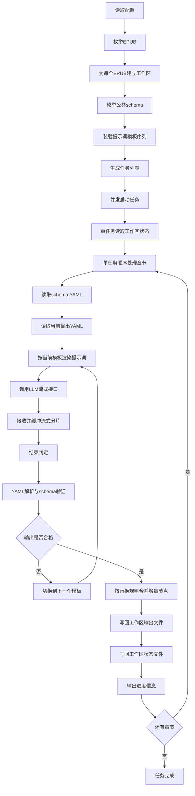

# EPUB 小说信息抽取设计文档

## 1. 目标

构建一个最小可行方案，使用 Python 与 LangChain 或 LangGraph，从 EPUB 小说中按章节连续提取信息，并依据公共 `schemas` 目录中选定的一个或多个 YAML schema，分别生成独立的 YAML 输出文件。

系统应满足以下要求：

- 单个处理任务面向单个 EPUB 文件
- 每个 EPUB 拥有自己的工作路径，避免不同 EPUB 的中间状态与结果混在一起
- 处理粒度为章节
- 每处理一章，持续更新目标 YAML 文档
- 每个 schema 对应一个独立 YAML 输出文件
- schema 文件是公共通用资源，不随单个 EPUB 复制
- schema 文件本身为带注释的 YAML，注释中包含字段要求与抽取说明
- 支持长时间运行场景下的状态保存、错误重试与恢复
- 支持 API 流式传输，降低长输出导致 CDN 超时或连接中断的风险
- 支持 schema 验证，用于检查 LLM 输出结构是否符合要求
- 支持输出处理进度信息，便于简单监控运行状态
- 明确定义增量输出语义，避免合并行为不确定
- 增加 `prompts/` 目录，支持多个提示词模板按顺序尝试与降级
- 需要把现有原始提示词整理为模板形式，明确固定说明与可替换占位符的边界
- 角色与设定更新不再包含历史遗留的 `scenario` 输出流程
- 支持以 `EPUB × schema` 为单位并发处理，不共享运行状态
- 避免数据库、任务队列、复杂缓存与复杂多代理结构

## 2. 设计原则

### 2.1 最小实现优先

仅保留完成目标所需的最少组件：

- EPUB 章节读取
- schema 装载
- 提示词模板装载
- 提示词渲染
- 单模型调用
- 流式响应接收
- schema 验证
- 增量结果替换式合并
- YAML 合并更新
- 任务级状态记录
- 断点恢复
- 有界错误重试
- 模板顺序切换
- 进度信息输出

### 2.2 状态尽量落在文件系统

- 结构化结果状态以输出 YAML 文件为准
- 任务进度以独立状态文件为准
- 重试状态也写入任务状态文件
- 流式响应的临时缓冲也落在任务工作区
- 进度监控信息优先复用状态文件与日志输出
- 提示词模板文件独立存放于 `prompts/`
- 不引入数据库

### 2.3 schema 公共化

- schema 是公共通用资源，集中存放在 `schemas/`
- 不把字段结构硬编码在程序中
- 由 schema 文件决定抽取目标与输出结构
- 利用 schema 注释补充提示词说明
- 利用 schema 结构与注释派生最小验证规则

### 2.4 单任务顺序处理

- 单个 `EPUB × schema` 任务按章节顺序处理
- 每章读取已有 YAML 作为当前状态
- 本章抽取结果按预定义替换规则合并回目标 YAML

### 2.5 任务级隔离与并发

- 同一个 EPUB 的不同 schema 可以并发处理
- 不同 EPUB 的处理任务可以并发处理
- 并发只发生在任务边界，不打乱单个任务内部的章节顺序
- 每个 EPUB 在自己的工作区下保存状态与输出

### 2.6 长任务可恢复

- 章节处理后立即落盘
- 每个任务维护自己的恢复点
- 中断后可从最近已完成章节继续处理

### 2.7 重试必须有边界

- 对网络抖动、模型临时失败、格式不合法等错误允许有限重试
- 重试次数固定且可配置，避免无限循环
- 超过重试上限后写入失败状态，等待后续恢复或人工处理

### 2.8 流式结果必须先缓冲再提交

- API 流式传输只用于接收模型输出，不直接写入最终 YAML
- 只有在流式响应明确结束且通过校验后，才合并到正式输出
- 如果流中断或内容不完整，则丢弃本次临时结果并按重试策略处理

### 2.9 验证先于合并

- LLM 输出必须先通过 YAML 解析
- 解析后的结构必须通过 schema 验证
- 只有验证通过的结果才允许进入合并阶段

### 2.10 进度信息可观察

- 运行中应输出简洁进度信息到控制台或日志
- 任务状态文件应包含足够的章节进度字段
- 不要求复杂监控系统，但要求人工能快速判断运行到哪里、是否卡住、是否失败

### 2.11 增量输出语义必须固定

- LLM 每章输出的不是完整文档快照，而是用于替换的增量节点集合
- 对 `actors` 采用 同名角色节点全量替换
- 对 `worldinfo` 采用 同名世界节点全量替换
- 不引入 add、remove、patch 等复杂补丁语义

### 2.12 模板策略必须可降级

- 提示词模板以文件形式存放在 `prompts/`
- 每个任务按预定义顺序尝试模板
- 若当前模板产生的输出不符合要求，则切换到下一个模板
- 模板切换是 重试策略 的一部分，但比通用重试更细粒度

### 2.13 模板结构必须显式化

- 原始提示词中的固定规则应沉淀为模板正文
- 原始提示词中的上下文输入应统一替换为占位符
- 模板文件必须能直接让人看出 输入区、规则区、输出区 的边界
- 模板文件必须适合后续扩展为多个变体版本

## 3. 范围

### 3.1 本次设计包含

- EPUB 按章节解析
- 公共 schema 装载
- 多 schema 独立处理
- per-epub 工作区隔离
- 章节级增量抽取
- 基于同名节点的全量替换合并
- YAML 文件更新
- 长时间运行下的状态保存与恢复
- LLM 输出校验与有限重试
- API 流式响应接收与缓冲
- 基于 schema 的结构验证
- 进度信息输出与状态监控
- 多提示词模板顺序尝试与降级
- 原始提示词向模板结构的标准化转换
- 基于 LangChain 或 LangGraph 的最小执行流
- `EPUB × schema` 任务级并发

### 3.2 本次设计不包含

- Web 界面
- 数据库持久化
- 向量检索
- 多模型路由
- 动态学习式提示词优化
- 人工审核工作台
- 通用补丁语言
- 复杂冲突解决策略
- 跨任务共享状态的复杂分布式调度
- 历史遗留的 `scenario` 输出链路

## 4. 推荐目录结构

```text
project/
  prompts/
    base.md
    retry_format.md
    retry_schema.md
  schemas/
    characters.yaml
    world.yaml
  input/
    novel.epub
    other_novel.epub
  workspace/
    novel/
      source/
        novel.epub
      output/
        characters.yaml
        world.yaml
      state/
        characters.progress.yaml
        world.progress.yaml
      temp/
        characters.stream.txt
        world.stream.txt
      logs/
        run.log
    other_novel/
      source/
        other_novel.epub
      output/
        characters.yaml
      state/
        characters.progress.yaml
      temp/
        characters.stream.txt
      logs/
        run.log
  src/
    app.py
    epub_reader.py
    schema_loader.py
    schema_validator.py
    prompt_loader.py
    prompt_builder.py
    extractor_graph.py
    yaml_store.py
    progress_store.py
    task_runner.py
    workspace_manager.py
```

说明：

- `prompts/` 存放多个提示词模板文件
- `schemas/` 存放公共通用的带注释 YAML schema
- `workspace/` 下每个 EPUB 一个独立工作目录
- 每个 EPUB 工作目录下再细分 `source/`、`output/`、`state/`、`temp/`、`logs/`
- `temp/` 用于保存流式响应的临时缓冲内容
- `state/` 中的进度文件既用于恢复，也用于简单监控
- 不同 EPUB 的状态、输出、日志互不混放
- `src/` 只保留最少模块

## 5. 工作区模型

每个 EPUB 都有自己的独立工作路径，建议以 EPUB 文件名派生一个稳定工作目录。

例如：

- `input/novel.epub` → `workspace/novel/`
- `input/other_novel.epub` → `workspace/other_novel/`

单个工作区包含：

- EPUB 源文件副本或引用信息
- 当前 EPUB 对应的全部 schema 输出
- 当前 EPUB 对应的全部任务进度文件
- 当前 EPUB 对应的流式响应临时文件
- 当前 EPUB 的运行日志

这样可以保证：

- 一个 EPUB 的任务失败不会污染另一个 EPUB 的状态
- 删除或重跑某个 EPUB 时，只需处理自己的工作区
- 恢复时不需要从全局目录中筛选属于哪个 EPUB 的文件

## 6. 核心流程



## 6.1 并发边界

最小实现允许在任务边界上并发：

- 同一个 EPUB 的不同 schema 可以并发处理
- 不同 EPUB 的处理任务可以并发处理
- 每个并发单元以一个 `EPUB × schema` 组合为单位

每个并发单元都应满足：

- 读取公共 schema 文件
- 读取公共提示词模板文件
- 只写入所属 EPUB 工作区下的输出 YAML 文件
- 只维护所属 EPUB 工作区下的进度文件
- 只使用所属 EPUB 工作区下的流式临时缓冲文件
- 不与其他任务共享内存状态

因此，并发不会改变单个任务内部的章节顺序要求。对于单个 `EPUB × schema` 任务，仍然必须按章节顺序增量更新，避免跨章节乱序写入。

## 7. 最小架构选择

### 7.1 Python

Python 作为主语言，负责：

- EPUB 解析
- YAML 读写
- 文件组织
- LLM 调用编排
- 并发任务调度
- 状态保存与恢复
- 错误分类与重试
- 流式响应接收与拼接
- schema 验证
- 增量节点替换合并
- 模板装载与切换
- 进度输出

### 7.2 LangChain

LangChain 用于：

- 模型适配
- PromptTemplate 管理
- 结构化输出链路封装
- 流式模型接口接入

### 7.3 LangGraph

LangGraph 只做最轻量的顺序状态编排，不构建复杂图。

建议每个 `EPUB × schema` 任务采用单条主线：

- 读取章节状态
- 针对当前章节执行抽取
- 按当前模板渲染提示词
- 流式接收输出并缓冲
- 解析与 schema 验证
- 校验失败时切换模板或执行有限重试
- 按同名节点替换规则合并
- 更新任务进度
- 输出进度信息

如果实现阶段希望进一步简化，也可以先用普通 Python 循环完成单任务流程，保留向 LangGraph 迁移的边界。设计上仍建议提供一个极小 LangGraph 封装层，使后续恢复与调试更清晰。

### 7.4 任务调度

建议增加一个极简任务调度层，仅负责：

- 根据 EPUB 列表和公共 schema 列表生成任务
- 控制并发数
- 启动独立任务执行器

不负责：

- 全局共享状态管理
- 复杂优先级调度
- 分布式锁

## 8. 关键模块设计

### 8.1 `epub_reader.py`

职责：

- 读取 EPUB
- 提取有序章节列表
- 返回章节编号、章节标题、章节文本

输出建议：

```yaml
chapters:
  - chapter_index: 1
    chapter_id: ch001
    title: 第一章
    text: 章节正文
```

要求：

- 保持章节顺序稳定
- 为每章生成稳定 `chapter_id`
- 跳过空章节或仅导航内容

### 8.2 `workspace_manager.py`

职责：

- 为每个 EPUB 创建稳定工作目录
- 生成 `source/`、`output/`、`state/`、`temp/`、`logs/` 子目录
- 解析当前任务对应的输出路径、状态路径与流式缓冲路径

最小输出示意：

```yaml
workspace:
  epub_name: novel
  root: workspace/novel
  source_dir: workspace/novel/source
  output_dir: workspace/novel/output
  state_dir: workspace/novel/state
  temp_dir: workspace/novel/temp
  logs_dir: workspace/novel/logs
```

### 8.3 `schema_loader.py`

职责：

- 读取公共 schema 文件
- 保留 YAML 主体结构
- 尽可能保留注释文本用于提示词构造
- 提取最小结构规则供验证器使用
- 提取增量输出的根节点与匹配键定义

最小实现建议：

- 使用支持注释保留的 YAML 库读取 schema
- 将字段路径、示例值、注释说明整理为中间表示
- 同时生成基础验证元数据
- 为替换式合并提供根节点名称与匹配键

中间表示示意：

```yaml
schema_name: characters
schema_path: schemas/characters.yaml
root_key: actors
match_key: name
fields:
  - path: actors[].name
    type: string
    required: true
    instruction: 角色名，使用正式中文名
```

### 8.4 `prompt_loader.py`

职责：

- 从 `prompts/` 目录读取模板文件
- 按预定义顺序返回模板列表
- 提供模板名称、模板内容与顺序索引

最小模板顺序建议：

1. `prompts/base.md`
2. `prompts/retry_format.md`
3. `prompts/retry_schema.md`

说明：

- 第一个模板用于常规抽取
- 第二个模板用于 YAML 格式错误后的纠正
- 第三个模板用于 schema 验证失败后的纠正

### 8.5 `schema_validator.py`

职责：

- 对 LLM 输出做结构验证
- 基于 schema 骨架和字段规则检查结果是否合法
- 返回可读错误摘要，供重试提示词使用

最小验证范围建议：

- 根节点名称是否存在
- 字段是否出现在允许位置
- 标量与列表的基本类型是否匹配
- 必填字段是否缺失
- 对象列表元素是否满足最小结构要求
- 增量输出是否只包含允许的根节点
- 增量节点是否包含匹配键

验证结果示意：

```yaml
validation:
  ok: false
  errors:
    - path: actors[0].name
      reason: required field is missing
    - path: actors[0].aliases
      reason: expected list but got string
```

说明：

- 最小版本只做结构与必填检查
- 不追求完整通用 schema 引擎
- 注释中的字段说明可以转化为更友好的错误信息

### 8.6 `prompt_builder.py`

职责：

- 将模板文件与运行时数据渲染成最终提示词
- 拼接当前章节内容
- 拼接已有 YAML 摘要或全文
- 明确说明当前 schema 的增量输出格式
- 在重试时注入错误摘要

模板占位符最小约定：

- `{{source_text}}` 当前章节原文
- `{{schema_text}}` 当前 schema 文本
- `{{existing_yaml}}` 当前已有输出 YAML
- `{{existing_worldinfo}}` 当前已有世界设定 YAML
- `{{error_summary}}` 最近一次错误摘要
- `{{root_key}}` 当前 schema 根节点
- `{{match_key}}` 当前 schema 匹配键
- `{{output_rules}}` 当前增量输出规则

核心原则：

- 只更新当前 schema 对应内容
- 未确认信息不强行补全
- 对 `actors` 返回本章涉及的完整角色节点列表
- 对 `worldinfo` 返回本章涉及的完整世界节点列表
- 输出必须是合法 YAML
- 如果上一次输出不合法，重试模板应明确指出错误原因
- 输出必须能够通过流式拼接后形成完整文档
- 不再依赖历史遗留的 scenario 上下文

### 8.7 `extractor_graph.py`

职责：

- 组织单个 `EPUB × schema` 任务的章节级执行流程
- 管理当前章节、当前 schema、当前输出文件路径
- 串联模型调用、流式缓冲、验证、模板切换、重试与持久化

最小状态建议：

```yaml
run_state:
  epub_path: input/novel.epub
  workspace_root: workspace/novel
  chapter_index: 12
  chapter_id: ch012
  total_chapters: 120
  schema_name: characters
  schema_path: schemas/characters.yaml
  root_key: actors
  match_key: name
  current_prompt_template: prompts/base.md
  prompt_template_index: 0
  output_path: workspace/novel/output/characters.yaml
  progress_path: workspace/novel/state/characters.progress.yaml
  stream_buffer_path: workspace/novel/temp/characters.stream.txt
```

建议节点：

- load_schema
- load_prompt_templates
- load_current_output
- build_prompt
- call_model_stream
- collect_stream_chunks
- validate_yaml
- validate_schema
- switch_prompt_if_needed
- retry_if_needed
- replace_increment_nodes
- save_output
- save_progress
- emit_progress

### 8.8 `task_runner.py`

职责：

- 接收一个 `EPUB × schema` 任务定义
- 按章节顺序执行该任务
- 在每章结束后保存结果与状态
- 在可恢复错误场景下执行有限重试
- 管理流式响应的接收、结束判定与清理
- 管理提示词模板顺序切换
- 输出简洁进度信息
- 向上层返回成功或失败状态

任务定义示意：

```yaml
task:
  epub_path: input/novel.epub
  workspace_root: workspace/novel
  schema_path: schemas/characters.yaml
  prompt_templates:
    - prompts/base.md
    - prompts/retry_format.md
    - prompts/retry_schema.md
  output_path: workspace/novel/output/characters.yaml
  progress_path: workspace/novel/state/characters.progress.yaml
  stream_buffer_path: workspace/novel/temp/characters.stream.txt
```

模板切换规则建议：

- 默认从第一个模板开始
- 如果输出不是合法 YAML，优先切换到下一个格式纠正模板
- 如果 YAML 合法但 schema 验证失败，切换到下一个结构纠正模板
- 如果所有模板都尝试过仍失败，再计入章节级失败并触发更高层重试或终止

进度输出示例：

```text
[novel][characters] chapter 12/120 template=base status=running retries=1
[novel][characters] chapter 12/120 template=retry_schema status=retrying last_error=schema validation failed
```

### 8.9 `yaml_store.py`

职责：

- 读取结果 YAML
- 初始化空结果文件
- 按增量输出定义执行替换式合并
- 写回 YAML

最小合并策略：

- 对 `actors` 根下的每个角色对象，以 `name` 为匹配键
- 如果 `name` 相同，则用本章返回的完整角色节点替换现有同名节点
- 如果 `name` 不存在于现有结果，则追加为新节点
- 对 `worldinfo` 根下的每个对象，也以 `name` 为匹配键
- 如果 `name` 相同，则用本章返回的完整世界节点替换现有同名节点
- 如果 `name` 不存在于现有结果，则追加为新节点

注意：

- 这里的 增量 指的是 节点级增量，不是字段级补丁
- 单个节点一旦出现在本章输出中，就视为该节点的完整最新版本
- 不做节点内部字段级 merge，直接整节点替换
- 若缺少匹配键，则该节点视为非法输出

### 8.10 `progress_store.py`

职责：

- 记录任务处理进度
- 支持中断恢复
- 保存阶段性运行状态
- 保存最近一次错误与重试信息
- 保存最近一次流式接收状态摘要
- 保存可供人工观察的进度字段
- 保存最近一次增量替换统计
- 保存最近一次模板选择状态

建议格式：

```yaml
epub_path: input/novel.epub
workspace_root: workspace/novel
schema_path: schemas/characters.yaml
output_path: workspace/novel/output/characters.yaml
stream_buffer_path: workspace/novel/temp/characters.stream.txt
total_chapters: 120
last_completed_chapter_index: 12
last_completed_chapter_id: ch012
current_chapter_index: 13
completed_chapters: 12
progress_percent: 10.0
status: running
prompt:
  current_template: prompts/base.md
  template_index: 0
  attempted_templates:
    - prompts/base.md
retry:
  current_attempt: 0
  max_attempts: 3
  last_error: ""
stream:
  last_receive_status: completed
  last_chunk_count: 42
validation:
  last_result: passed
  last_error_count: 0
merge:
  replaced_nodes: 2
  appended_nodes: 1
updated_at: 2026-03-26T00:00:00Z
```

说明：

- 每个 `EPUB × schema` 组合维护一个独立进度文件
- 结果状态仍以对应输出 YAML 文件为准
- 进度文件只记录恢复、重试、验证、监控、模板状态与替换统计所需的最小信息
- 单个任务内部仍保持章节顺序，不需要更复杂游标

## 9. prompts 模板设计

为了降低单一提示词失效的风险，设计中增加 `prompts/` 目录并支持顺序模板切换。

### 9.1 模板文件形式

模板建议使用 Markdown 文本文件，便于阅读与维护，例如：

- `prompts/base.md`
- `prompts/retry_format.md`
- `prompts/retry_schema.md`

### 9.2 模板占位符

模板通过占位符注入运行时数据。最小占位符集合：

- `{{source_text}}`
- `{{schema_text}}`
- `{{existing_yaml}}`
- `{{existing_worldinfo}}`
- `{{error_summary}}`
- `{{root_key}}`
- `{{match_key}}`
- `{{output_rules}}`

### 9.3 模板顺序

建议模板顺序固定，不做动态学习：

1. 常规抽取模板
2. 格式修复模板
3. schema 修复模板

如果第三个模板仍失败，则判定本轮模板序列失败。

### 9.4 模板切换时机

- YAML 解析失败，切到格式修复模板
- schema 验证失败，切到结构修复模板
- 增量规则验证失败，也切到结构修复模板
- 网络错误和流式中断，默认继续使用当前模板重试，不必立刻切模板

### 9.5 模板切换与重试关系

模板切换属于 同一章节内部的一种局部恢复机制：

- 先在模板序列内部尝试纠正
- 模板全部失败后，再记为一次章节级失败
- 章节级失败再决定是否做更高层重试或终止任务

### 9.6 由原始提示词转换得到的模板结构示例

下面给出一个基于 `prompts/提示词.txt` 转换后的模板示例，用来确认 `prompts/` 目录下模板文件的最终结构形式。这个示例不追求把原始文本逐字保留，而是把 固定规则、占位符输入、输出要求 分层整理。

建议对应文件形态为 `prompts/base.md`：

```md
你是一个小说分析师专家。你的任务是分析小说内容，并把它转换为适合 AI Director 使用的结构化角色与设定更新结果。

## 任务目标

- 你需要考虑后续的 AI Director 是否能够直接理解这些信息
- 原文可能由日语翻译而来，可能存在名字不一致的问题，需要根据上下文合理猜测并修复
- 只关注角色总结与世界设定更新，不再输出 scenario 相关内容
- 输出目标从 {{root_key}} 开始

## 输出总要求

- 只输出本章更新过的角色和设定
- 未更新的角色和设定可以忽略
- 但凡输出了某个角色或设定，对应条目内容必须完整输出，不能缺失之前已有字段
- 总结中不要出现 当前、昨天、几年前 等依赖上下文的相对时间，应使用全知视角
- actors 中不能出现 略、同上、待补、当前、可能、不明、未提及、未知 等无意义值
- 缺少信息时可以优先从已有角色总结、已有设定中补全；若仍无信息，则直接忽略该字段
- worldinfo 的 content 可以是字符串，也可以是自定义结构
- 不输出 schema 中的注释

## 特殊内容规则

### 交合相关信息规范

- 如果原文涉及交合相关信息，只保留会影响角色设定和世界设定的关键结果
- 重点包括 破处、体位、射在哪里、插入哪里、主动方、受精、避孕、强迫、抵抗、开始原因、结束原因 等会影响角色信息的部分
- 不进行细节化描写
- 相关结果应体现在角色总结或设定更新中，而不是额外输出场景描述

## 增量输出规则

- 本次输出只返回更新过的完整节点
- 对 {{root_key}} 下的对象，以 {{match_key}} 为匹配键
- 同名节点会替换现有节点
- 新节点会追加到现有列表
- 不允许输出字段级 patch 或不完整节点

## 已有上下文

### 之前生成的人物总结
```yaml
{{existing_yaml}}
```

### 之前生成的设定
```yaml
{{existing_worldinfo}}
```

## 当前 schema
```yaml
{{schema_text}}
```

## 当前章节原文
```
{{source_text}}
```

## 输出要求

- 严格输出合法 YAML
- 只输出更新后的 {{root_key}}
- 不输出解释文字
- 不输出 markdown 代码围栏
- 输出必须满足以下规则：

{{output_rules}}
```

这个转换示例体现了模板结构的四层：

1. 角色设定层，也就是固定身份与任务目标
2. 规则层，也就是长期稳定的抽取约束
3. 上下文输入层，也就是章节原文、schema、已有数据等占位符
4. 输出层，也就是本次任务的 YAML 输出边界

### 9.7 哪些内容固定，哪些内容占位

#### 固定内容

适合作为模板正文固定保留的部分：

- 任务身份说明
- 输出目标说明
- 特殊内容规则
- 输出格式约束
- 无意义值禁止规则
- 增量替换规则

#### 占位内容

适合改为占位符动态注入的部分：

- 当前章节原文
- 当前 schema 文本
- 之前生成的人物总结
- 之前生成的设定
- 错误摘要
- 当前任务的根节点名
- 当前任务的匹配键
- 当前输出规则说明

### 9.8 模板示例的适用边界

这个由 `prompts/提示词.txt` 转换来的模板示例更接近 角色和世界设定更新 模板，而不是通用模板。

因此建议：

- 把它作为 `prompts/base.md` 的结构参考
- 后续的 `prompts/retry_format.md` 在此基础上缩短规则，突出 YAML 格式修复
- 后续的 `prompts/retry_schema.md` 在此基础上缩短规则，突出 schema 验证错误修复

## 10. schema 驱动抽取设计

### 10.1 schema 文件角色

schema 文件不仅提供字段结构，还提供抽取说明。

例如：

```yaml
actors:
  # 主角色列表，持续累积
  - name: ""
    # 常用别名，去重
    aliases: []
    # 首次出现章节
    first_appearance: ""
```

在设计中，程序不直接把该文件当作 JSON Schema 使用，而是把它作为：

- 输出骨架模板
- 字段说明来源
- 提示词约束来源
- 基础验证规则来源
- 增量节点根路径与匹配键来源

### 10.2 schema 解析最小策略

最小实现建议从 schema 中抽取五类信息：

1. 输出根结构
2. 字段路径
3. 字段注释说明
4. 字段最小约束，如类型与必填性
5. 增量替换规则，如根节点和匹配键

最终生成一个面向提示词、验证器和合并器的中间对象。

### 10.3 提示词构造方式

对于每个 schema，构造提示词时应包含：

- schema 名称
- 字段路径
- 字段注释
- 输出示例骨架
- 本章文本
- 当前已有 YAML
- 增量输出定义

这样可以让模型理解：

- 需要填哪些字段
- 字段含义是什么
- 当前已有结果有哪些
- 本章能新增或修正哪些信息
- 应返回哪些完整节点用于替换

如果是重试轮次，还应追加：

- 上一次输出的错误摘要
- 哪些字段不符合 schema 要求
- 哪些节点缺少匹配键
- 明确要求模型只返回修正后的合法 YAML

如果启用流式返回，还应明确：

- 整个响应必须可按顺序拼接为单个完整 YAML 文档
- 不输出额外解释文字
- 不在响应中插入与 YAML 无关的前后缀

## 11. 增量输出定义

为了避免合并逻辑复杂化，本项目采用 节点级全量替换 的最小方案。

### 11.1 基本原则

增量输出不是：

- 完整 schema 快照
- 通用 patch 操作列表
- 字段级 merge 指令

增量输出定义为：

- 本章识别到的、需要新增或更新的完整节点集合
- 程序按节点匹配键查找现有结果
- 找到同名节点则整节点替换
- 找不到同名节点则追加新节点

### 11.2 `characters.yaml` 的增量定义

对 `schemas/characters.yaml`：

- 根节点为 `actors`
- 列表元素为角色节点
- 匹配键为 `name`

因此本章 LLM 输出应为：

```yaml
actors:
  - name: 张三
    aliases:
      - 阿三
    identity: 镖师
    first_appearance: 第3章
```

处理语义：

- 若现有 `actors` 中已有 `name: 张三`，则整个张三节点被替换
- 若不存在张三，则将该节点追加到 `actors` 列表中

### 11.3 `world.yaml` 的增量定义

对 `schemas/world.yaml`：

- 根节点为 `worldinfo`
- 列表元素为世界信息节点
- 匹配键同样采用 `name`

因此本章 LLM 输出应为：

```yaml
worldinfo:
  - name: 黑风寨
    type: 势力
    description: 位于山谷中的山寨
```

处理语义：

- 若现有 `worldinfo` 中已有 `name: 黑风寨`，则整个黑风寨节点被替换
- 若不存在黑风寨，则追加该节点

### 11.4 为什么采用整节点替换

原因如下：

- 合并逻辑最简单
- LLM 不需要学习复杂补丁语义
- 验证规则清晰，容易判断输出是否合法
- 恢复和重试时幂等性更好

代价是：

- 模型在更新某个节点时，应输出该节点的完整版本，而不是只给局部字段

### 11.5 非法增量输出

以下情况视为非法：

- 输出缺少根节点 `actors` 或 `worldinfo`
- 列表元素缺少匹配键 `name`
- 列表元素不是对象结构
- 输出尝试直接覆盖根节点之外的全局结构

## 12. schema 验证设计

为了确保 LLM 输出可安全进入合并阶段，必须在每章处理后执行 schema 验证。

### 12.1 验证顺序

验证顺序建议为：

1. 流式结束完整性检查
2. YAML 解析检查
3. schema 结构检查
4. 增量输出规则检查
5. 通过后再进入合并

### 12.2 最小验证规则

最小版本应至少验证：

- 根节点名称是否正确
- 顶层结构类型是否正确
- 必填字段是否存在
- 字段值是否满足标量、对象、列表的基本类型要求
- 列表元素是否具备最小对象结构
- 不允许明显越权的未知结构覆盖关键节点
- 增量节点是否具备匹配键 `name`

### 12.3 验证失败处理

如果验证失败：

- 不合并到正式 YAML
- 将验证错误写入进度文件
- 将错误摘要传给下一次重试提示词
- 计入当前章节的重试次数

### 12.4 验证输出示例

```yaml
validation:
  ok: false
  errors:
    - path: actors[0].name
      reason: required field is missing
    - path: actors[0]
      reason: missing match key name
```

## 13. 章节级连续处理设计

单个 `EPUB × schema` 任务的处理步骤如下：

1. 从 EPUB 中读取章节文本
2. 读取当前任务状态，确定是否跳过已完成章节
3. 读取该 schema 对应输出 YAML
4. 读取提示词模板序列
5. 选择当前模板并构造提示词
6. 调用 LLM 流式接口生成本章增量结果
7. 将流式分片顺序写入临时缓冲文件并同时维护内存缓冲
8. 在收到完整结束信号后执行 YAML 解析、schema 验证和增量规则验证
9. 若输出不合格，则切换到下一个模板继续尝试
10. 模板序列全部失败后，再进入章节级有限重试
11. 按同名节点全量替换规则合并结果并写回对应 YAML
12. 更新该任务自己的进度文件
13. 输出当前处理进度信息
14. 清理当前章节的临时流式缓冲文件
15. 继续处理下一章，直到结束

关键点：

- 每个任务只在所属 EPUB 工作区下的输出、状态与临时文件上写入
- 如果中途中断，已写入的正式 YAML 仍保留，下次从上次完成章节继续
- 临时流式文件不能直接替代正式输出文件
- 恢复时允许重新处理最后一章，前提是整节点替换具备幂等性
- 即使系统整体并发运行，单任务内部仍严格顺序处理章节
- 重试只发生在当前章节内，不应跨章节回滚整个任务

## 14. 长时间运行与恢复设计

考虑到 EPUB 可能很大，处理耗时较长，必须优先保证可恢复性。

### 14.1 落盘时机

最小实现建议在以下时机立即落盘：

- 初始化任务时写入初始进度文件
- 每次收到流式分片时追加写入临时缓冲文件
- 每次模板切换后写入当前模板状态
- 每完成一章后写回输出 YAML
- 每完成一章后写回进度文件
- 每次验证失败或重试失败后写回最近错误摘要
- 任务失败时写回失败状态
- 任务完成时写回完成状态

### 14.2 恢复规则

任务启动时按以下顺序恢复：

1. 定位 EPUB 对应工作区
2. 读取对应 schema 的进度文件
3. 校验输出 YAML 是否可解析
4. 检查是否存在未完成的流式临时文件
5. 若存在未完成流式临时文件，则丢弃该临时文件并从当前章节重新开始
6. 若进度与输出均存在，则从下一章继续
7. 若进度存在但输出损坏，则停止并要求人工处理
8. 若进度不存在，则从第一章开始

### 14.3 最小状态字段

建议进度文件至少包含：

```yaml
status: running
total_chapters: 120
last_completed_chapter_index: 12
current_chapter_index: 13
progress_percent: 10.0
updated_at: 2026-03-26T00:00:00Z
```

必要时可附加：

```yaml
prompt:
  current_template: prompts/retry_schema.md
  template_index: 2
  attempted_templates:
    - prompts/base.md
    - prompts/retry_format.md
retry:
  current_attempt: 1
  max_attempts: 3
  last_error: schema validation failed
stream:
  last_receive_status: interrupted
  last_chunk_count: 19
validation:
  last_result: failed
  last_error_count: 2
merge:
  replaced_nodes: 2
  appended_nodes: 1
```

### 14.4 幂等要求

为了支持恢复，以下操作需要尽量幂等：

- 重复读取同一章节不会破坏状态
- 同一章节重复输出同名节点时，整节点替换不会产生重复数据
- 重启任务后可以安全从最后完成章节继续
- 丢弃未完成流式缓冲后重新请求同一章节不会污染正式输出

### 14.5 重试与恢复协同

重试状态也应被纳入恢复设计：

- 如果任务在某章节的重试过程中异常退出，下次启动时应回到该章节重新开始
- 不需要恢复到某次中间重试轮次，只需要保留最近错误摘要和模板尝试记录供下一次运行参考
- 当某章节超过最大重试次数时，将任务标记为 `failed`
- 人工修复配置、网络或模板后，可基于同一工作区再次启动恢复

## 15. 流式传输设计

考虑到输出较长时可能因 CDN 或中间层超时而失败，默认应优先使用流式 API。

### 15.1 流式接收原则

- 使用支持流式输出的模型接口
- 逐块接收响应分片
- 分片先写入临时缓冲，再在结束后统一解析
- 只有收到明确结束事件后，才进入解析、验证与合并阶段

### 15.2 缓冲策略

最小实现建议双层缓冲：

- 内存缓冲用于当前请求快速拼接
- 文件缓冲写入 `workspace/.../temp/*.stream.txt` 防止长响应中途进程退出导致全部丢失

文件缓冲的作用：

- 便于排查流式返回被截断的问题
- 便于恢复时识别上一轮是否是未完成流
- 避免仅依赖内存导致长响应完全丢失

### 15.3 结束判定

只有满足以下条件才认为本次流式输出有效：

- 收到 SDK 或 API 提供的完成事件
- 本地接收循环正常结束，没有异常中断
- 拼接后的全文可以通过 YAML 解析
- 拼接后的结构可以通过 schema 验证
- 拼接后的增量节点可以通过替换规则验证

否则视为失败，进入重试。

### 15.4 流中断处理

以下情况视为流式失败：

- 网络连接中断
- CDN 超时
- 服务端在完成前断开连接
- 本地接收异常终止
- 最终拼接结果不完整

处理方式：

- 记录错误原因到状态文件
- 保留临时流文件用于诊断
- 不写入正式输出 YAML
- 按章节级重试策略重新请求

### 15.5 流式与重试协同

- 如果流在中途断开，不尝试从中间续传本次响应
- 直接丢弃本次未完成结果，并重新发起当前章节请求
- 重试提示词可附带 上次响应被截断或不完整 的错误信息
- 达到最大重试次数后将任务标记为失败

## 16. 输出与持久化策略

### 16.1 每个 EPUB 在自己的工作区内输出

映射关系如下：

- `schemas/characters.yaml` + `input/novel.epub` → `workspace/novel/output/characters.yaml`
- `schemas/world.yaml` + `input/novel.epub` → `workspace/novel/output/world.yaml`
- `schemas/characters.yaml` + `input/other_novel.epub` → `workspace/other_novel/output/characters.yaml`

优点：

- 公共 schema 与运行时结果清晰分离
- 不同 schema 的更新互不干扰
- 不同 EPUB 的结果、状态、日志、流式缓冲互不干扰
- 便于并发执行、单独校验、重跑与清理

### 16.2 初始化

首次运行时：

- 若 EPUB 工作区不存在，则先创建工作区
- 若输出 YAML 不存在，则根据 schema 骨架创建空白结果文件
- 若对应任务进度文件不存在，则写入初始状态并从第一章开始
- 若存在旧的未完成流式缓冲文件，则在新任务开始前清理或归档

### 16.3 更新原则

- 每章处理后立即写回对应 schema 输出文件
- 仅在该 schema 范围内更新
- 使用 同名节点整节点替换 或 追加 的固定规则
- 临时流式缓冲只在当前章节完成前存在

### 16.4 校验原则

最小实现下建议四级校验：

1. 流式结束完整性校验
2. YAML 可解析校验
3. 基于 schema 的基础结构校验
4. 增量节点匹配键与替换规则校验

不建议在最小版本中引入过强约束，否则会增加提示词与错误恢复复杂度。

## 17. 进度信息输出设计

为了简单监控处理状态，设计中要求同时提供 控制台进度输出 和 状态文件进度输出。

### 17.1 控制台输出

最小格式建议包含：

- EPUB 名称
- schema 名称
- 当前章节与总章节
- 当前模板
- 当前状态
- 当前重试次数
- 最近错误摘要
- 最近替换统计

示例：

```text
[novel][characters] 13/120 template=base status=running retries=1 replaced=2 appended=1
[novel][world] 13/120 template=retry_schema status=retrying last_error=schema validation failed
```

### 17.2 状态文件输出

进度文件应持续更新以下信息：

- `total_chapters`
- `current_chapter_index`
- `last_completed_chapter_index`
- `completed_chapters`
- `progress_percent`
- `status`
- `prompt.current_template`
- `prompt.attempted_templates`
- `retry.current_attempt`
- `retry.last_error`
- `validation.last_result`
- `merge.replaced_nodes`
- `merge.appended_nodes`

这样即使没有实时终端，也可以通过查看 `workspace/.../state/*.progress.yaml` 快速判断任务运行状态。

### 17.3 状态值建议

建议使用固定状态值：

- `pending`
- `running`
- `retrying`
- `failed`
- `completed`

### 17.4 最小监控结论

最小版本不需要单独监控服务。只要做到：

- 每章后刷新状态文件
- 每次模板切换时刷新当前模板
- 每次重试时刷新错误信息
- 控制台持续打印简洁进度行

就足以支撑人工监控。

## 18. LLM 调用策略

最小实现建议单模型、流式输出，外加必要时的有限重试与模板降级。

### 输入

- schema 描述
- 当前章节文本
- 当前已有结果 YAML
- 当前模板文件

### 输出

本项目不再建议完整快照输出，而统一采用 节点级增量输出。

对 `schemas/characters.yaml`：

- 返回 `actors` 下本章涉及的完整角色节点
- 以 `name` 匹配现有角色并整节点替换

对 `schemas/world.yaml`：

- 返回 `worldinfo` 下本章涉及的完整世界节点
- 以 `name` 匹配现有世界节点并整节点替换

该方案优点：

- 合并逻辑简单
- 输出长度更短
- 更适合流式传输
- 更利于幂等恢复

### 18.1 模板切换策略

最小实现建议模板按顺序尝试：

1. `prompts/base.md`
2. `prompts/retry_format.md`
3. `prompts/retry_schema.md`

切换规则：

- YAML 解析失败，优先进入 `prompts/retry_format.md`
- schema 验证失败，优先进入 `prompts/retry_schema.md`
- 增量规则验证失败，也进入 `prompts/retry_schema.md`
- 网络错误或流中断，默认保留当前模板重试

### 18.2 重试策略

最小实现建议采用固定上限重试，例如每章每任务最多 3 次。

按错误类型区分：

- 网络错误，直接重试原请求
- LLM 超时，直接重试原请求
- 流式连接被中断，重新发起当前章节请求
- YAML 解析失败，先切换模板，再在必要时重试
- schema 验证失败，先切换模板，再在必要时重试
- 增量节点缺少 `name` 或根节点错误，先切换模板，再在必要时重试
- 文件写入失败，短暂等待后重试本地写入

策略要求：

- 先在模板序列内尝试纠正
- 模板序列耗尽后，才记为章节级失败
- 达到章节级重试上限后终止当前任务并写入失败状态

## 19. 错误处理策略

最小实现仅处理以下错误：

- EPUB 解析失败
- schema 加载失败
- 提示词模板加载失败
- 模板占位符渲染失败
- 网络错误
- LLM 超时或服务端临时错误
- 流式连接中断或流式结束不完整
- 模型输出非 YAML
- 模型输出不符合 schema 结构
- 模型输出不符合增量替换规则
- YAML 合并失败
- 文件写入失败
- 状态文件损坏

处理原则：

- 当前任务的当前章节失败时，先根据错误类型执行模板切换或有限重试
- 重试成功后继续当前任务，不影响后续章节
- 超过重试上限后，不更新该章节完成进度
- 保留已存在输出文件与进度文件
- 保留最近一次流式临时文件用于诊断，必要时可清理
- 进度文件中记录失败状态、最后错误、重试次数、模板状态、验证结果、替换统计与流式状态
- 其他并发任务可继续执行

## 20. 配置建议

建议保留单个配置文件，内容包括：

```yaml
input_epubs:
  - input/novel.epub
  - input/other_novel.epub
schema_paths:
  - schemas/characters.yaml
  - schemas/world.yaml
prompt_templates:
  - prompts/base.md
  - prompts/retry_format.md
  - prompts/retry_schema.md
workspace_root: workspace
concurrency:
  enable_parallel_tasks: true
  task_unit: epub_schema
  max_workers: 4
model:
  provider: openai
  name: gpt-4.1
  streaming: true
runtime:
  resume: true
  retry_count: 3
  retry_backoff_seconds: 3
progress:
  emit_console_progress: true
```

保持配置扁平，避免过度抽象。

## 21. 实施步骤

1. 定义 `prompts/`、`schemas/`、输入目录与 per-epub 工作区结构
2. 实现 `workspace_manager.py` 生成稳定工作路径
3. 实现 EPUB 章节读取
4. 实现带注释 YAML schema 加载与中间表示转换
5. 实现 `prompt_loader.py` 读取模板序列
6. 将 `prompts/提示词.txt` 转换为 `prompts/base.md` 的模板结构，并移除历史遗留的 scenario 内容
7. 实现 `schema_validator.py` 做最小结构验证与增量规则验证
8. 明确 `schemas/characters.yaml` 的根节点为 `actors`、匹配键为 `name`
9. 明确 `schemas/world.yaml` 的根节点为 `worldinfo`、匹配键为 `name`
10. 实现每个 `EPUB × schema` 任务的输出、状态与流式缓冲文件初始化
11. 实现模板占位符渲染逻辑
12. 实现单章节单 schema 的流式 LLM 抽取
13. 实现流式分片缓冲、结束判定与完整性检查
14. 实现 YAML 解析与 schema 验证
15. 实现模板顺序切换与降级逻辑
16. 实现按同名节点整节点替换的合并逻辑
17. 实现结果校验错误摘要生成
18. 实现章节级有限重试机制
19. 实现章节完成后的任务级状态写入
20. 实现控制台进度输出与状态文件进度字段刷新
21. 实现长时间运行下的断点续跑与恢复检查
22. 实现极简任务调度层与并发控制
23. 验证单个 `EPUB × schema` 任务的顺序处理正确性
24. 验证 schema 验证失败时可正确阻止合并并触发模板切换
25. 验证格式错误时会切换到下一个模板
26. 验证同名节点替换与新节点追加行为符合预期
27. 验证网络错误、流中断与格式错误下的重试行为
28. 验证任务中断后可基于状态文件恢复
29. 验证多个 schema 与多个 EPUB 可通过独立任务并发执行

## 22. 最小实现建议结论

推荐采用以下方案作为第一版：

- Python 项目
- LangChain 负责模型调用与提示词封装
- LangGraph 仅保留极简顺序状态流，或先以普通循环实现同等流程
- 公共 `prompts/` 中放置多个按顺序尝试的模板文件
- 公共 `schemas/` 中放置带注释 YAML schema
- 每个 EPUB 在 `workspace/` 下拥有独立工作目录
- 每个 schema 输出写入对应 EPUB 工作区下的 `output/`
- 每个任务状态写入对应 EPUB 工作区下的 `state/`
- 流式输出的临时缓冲写入对应 EPUB 工作区下的 `temp/`
- 模型按章节流式输出节点级增量 YAML
- 对 `actors` 按 `name` 做整节点替换
- 对 `worldinfo` 按 `name` 做整节点替换
- 程序负责模板装载、提示词渲染、流式缓冲、YAML 解析、schema 验证、模板切换、替换合并并写回结果
- 运行时允许不同 schema 与不同 EPUB 并发执行，但单任务内部保持章节顺序
- 处理过程支持长时间运行、阶段性落盘、有限重试、模板降级、进度输出与断点恢复
- 角色与设定抽取链路不再包含 scenario 历史逻辑

该方案满足：

- 结构简单
- 易于实现
- 公共 prompts、schemas 与运行态数据隔离清晰
- 每个 EPUB 工作区独立，便于清理与重跑
- 支持中断恢复
- 支持 schema 结构验证
- 支持简单进度监控
- 支持固定增量输出语义
- 支持提示词模板顺序切换
- 支持将原始提示词标准化为可复用模板
- 支持网络错误、流中断与格式错误下的有限重试
- 支持长输出场景下通过流式传输降低 CDN 超时风险
- 支持不同 schema 与不同 EPUB 的任务级并发
- 后续可自然扩展更强校验与更复杂状态管理
