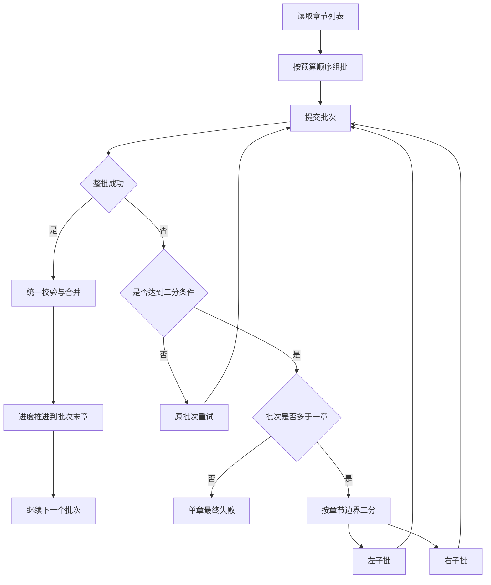

# EPUB 多章节批处理与失败后二分降级改造计划

## 1. 目标

将当前基于单章节请求的抽取流程，改造成基于顺序批次请求的流程。

目标约束如下：

- 一次请求可以提交多个完整章节
- 批次大小由上下文预算决定
- 严禁拆开任意单个章节提交
- LLM 对一个批次只返回一个批次级增量结果
- 只有整批通过校验后，才允许统一合并与推进进度
- 当批次失败时，优先对失败批次执行二分拆分并重试
- 二分过程始终保持章节顺序与章节完整性
- 只有降到单章仍失败时，才将该章节视为最终失败

## 2. 现状摘要

当前实现仍然以单章节为提交单位：

- 任务主循环位于 [`TaskRunner.run_task()`](../src/task_runner.py:63)
- 单章执行入口位于 [`TaskRunner._run_chapter()`](../src/task_runner.py:108)
- 提示词构造位于 [`PromptBuilder.build()`](../src/prompt_builder.py:9)
- 章节数据模型位于 [`Chapter`](../src/models.py:11)
- 章节文本中已经带有 [`token_estimate`](../src/models.py:17)，可作为组批估算基础

这意味着当前系统已经具备章节顺序、单章重试、单章校验、单章 merge、单章进度提交能力，但还没有批次级抽象。

## 3. 目标语义

### 3.1 处理粒度

运行时的实际提交粒度从 单章节 改为 顺序批次。

但系统仍以章节列表为基础组织数据，只是在提交给 LLM 之前，先把连续章节打包成一个批次。

### 3.2 提交与提交点

一个批次在逻辑上被视为一个原子结果。

只有当以下条件全部成立时，才认为该批次提交成功：

- 流式输出接收完成
- YAML 解析成功
- schema 校验成功
- 增量结构校验成功
- merge 成功写回结果文件
- progress 成功推进到该批次末章

只要其中任一步失败，该批次就不能算成功提交。

### 3.3 失败降级

当一个多章节批次失败时：

1. 先按批次级重试策略重试原批次
2. 若仍失败，且该批次包含多于一章，则对该批次执行二分
3. 左右子批分别独立执行同样的提交与校验流程
4. 若子批再次失败且仍包含多章，则继续二分
5. 若已经降到单章仍失败，则标记为最终失败

这个策略保留了大上下文批处理的收益，同时避免一个问题章节拖垮整批。

## 4. 批次构建规则

### 4.1 输入预算

组批时需要综合考虑三类预算：

- 章节正文输入预算
- 提示词固定开销预算
- 预留给模型输出的预算

建议基于 [`Chapter.token_estimate`](../src/models.py:17) 进行粗估，避免每次重复做昂贵 token 精算。

### 4.2 顺序组批规则

从当前未完成章节开始，按顺序累积章节：

1. 先加入当前章节
2. 估算加入下一章节后的总输入成本
3. 若未超过预算，则继续加入
4. 若超过预算，则在章节边界停止
5. 生成当前批次
6. 从下一个未打包章节继续生成下一批

### 4.3 不拆章规则

任何情况下都不能把一个章节拆成两部分提交。

若单章本身就超过常规预算：

- 该章节仍然必须单独成批
- 不允许为了适应预算而截断章节文本
- 该场景应被日志与进度明确记录为 单章超预算但允许单章批处理

## 5. 批次数据模型设计

建议在 [`src/models.py`](../src/models.py) 中新增批次模型，例如 `ChapterBatch`，至少包含以下字段：

- `batch_id`
- `parent_batch_id`
- `split_depth`
- `start_chapter_index`
- `end_chapter_index`
- `chapters`
- `token_estimate`
- `chapter_count`

语义要求：

- `batch_id` 用于日志、调试文件、状态文件关联
- `parent_batch_id` 用于表示该批次是否由某个失败批次拆分而来
- `split_depth` 用于表示当前是第几层二分子批
- `start_chapter_index` 与 `end_chapter_index` 用于快速标识批次范围
- `chapters` 保存实际章节对象列表
- `token_estimate` 记录整批估算值
- `chapter_count` 便于日志输出与调试

## 6. 提示词输入结构改造

当前 [`PromptBuilder.build()`](../src/prompt_builder.py:9) 只接收单个 [`Chapter`](../src/models.py:11)。

改造后应让提示词明确表达 当前输入由多个完整章节组成。

建议新增批次级输入片段，例如：

```text
### Chapter 5
chapter_id: ch005
chapter_title: 第五章
...

### Chapter 6
chapter_id: ch006
chapter_title: 第六章
...
```

提示词层面的要求：

- 必须保留每章边界
- 必须保留章节 ID 与标题
- 明确告诉模型这是连续章节集合
- 明确告诉模型只返回一个批次级增量 YAML
- 不要求模型按章拆分输出

建议把现有的 `{{source_text}}` 扩展为批次级拼接文本，或新增专门的批次占位符。

## 7. 执行流程改造

当前主循环在 [`TaskRunner.run_task()`](../src/task_runner.py:63) 中直接遍历章节。

改造后流程建议为：

1. 读取全部章节
2. 根据恢复位置截取剩余章节
3. 构建初始批次序列
4. 顺序处理批次
5. 批次成功后一次性提交到批次末章
6. 批次失败后执行批次级重试
7. 达到阈值后对失败批次执行二分
8. 子批仍按顺序递归处理
9. 任一最终失败则任务失败

建议将 [`TaskRunner._run_chapter()`](../src/task_runner.py:108) 演进为批次级函数，例如 `_run_batch()`。

## 8. 失败后二分规则

### 8.1 触发条件

二分不是首选动作，而是失败后的降级动作。

建议触发方式：

- 批次先执行正常模板尝试与章节级重试逻辑
- 当该批次达到批次级失败阈值后，再进入二分

### 8.2 二分方式

对失败批次的章节列表按顺序从中间切开：

- 左子批保留前半段连续章节
- 右子批保留后半段连续章节
- 不允许重排章节
- 不允许交错抽样章节

### 8.3 提交顺序

即使经过二分，提交顺序仍必须保持原始顺序：

- 先处理左子批
- 左子批成功后再处理右子批
- 这样才能保证结果状态与章节顺序一致

### 8.4 终止条件

二分递归在以下任一情况终止：

- 子批成功提交
- 子批已只剩单章且最终失败

## 9. 重试与恢复语义

### 9.1 重试层级

建议保留三层失败处理：

1. 模板切换
2. 同批次重试
3. 批次失败后二分

优先顺序应当固定：

- 先模板内部恢复
- 再重试同批次
- 最后对失败批次做二分

### 9.2 恢复点

恢复点必须以 已成功提交的批次末章 为准。

这意味着：

- 未完整成功的批次不能更新 `last_completed_chapter_index`
- 恢复时从最后一个成功提交批次的末章之后继续
- 不从某个失败批次的中间子批位置恢复
- 若存在残留调试流文件，可以清理后重跑当前未提交成功的批次树

### 9.3 幂等性

为了支持恢复与二分重试，必须保证：

- 同一成功批次重复 merge 不会引入重复节点
- 同一失败批次未成功前不会污染正式输出
- 子批成功提交后，其效果与原始大批次成功中的对应章节顺序一致

## 10. 进度与状态文件改造

当前进度文件以单章完成为推进单位。

改造后建议：

- 提交点仍记录在章节层面
- 但更新动作以批次成功为单位触发
- 一次成功后把 `last_completed_chapter_index` 直接推进到批次末章
- 额外记录当前运行批次范围与拆分状态

建议新增或补充以下状态字段：

- `current_batch_id`
- `current_batch_range`
- `current_batch_depth`
- `current_batch_parent_id`
- `batch_retry_count`
- `batch_status`
- `last_split_reason`

## 11. 日志与调试文件改造

日志与调试文件需要从单章命名演进为可表达批次范围。

建议统一体现以下信息：

- schema 名称
- 批次范围
- 拆分深度
- retry 次数
- 模板名称

建议命名风格示意：

```text
characters.ch0005-ch0009.d0.r01.base.prompt.txt
characters.ch0005-ch0006.d1.r01.base.response.yaml
characters.ch0007-ch0009.d1.r02.retry_schema.response.yaml
```

这样可以快速定位：

- 原始批次范围
- 是否为二分子批
- 是第几轮 retry
- 使用了哪个模板

## 12. merge 语义确认

即使输入从单章变为多章，merge 语义仍保持不变：

- 模型返回的是当前 schema 的增量 YAML
- 程序只接受合法增量结构
- 合法后再按现有节点替换规则 merge
- 不引入字段级 patch
- 不引入跨批次共享中间提交

区别只在于：

- 单次增量结果现在覆盖一个批次的多个章节信息
- merge 的提交点从单章成功改为整批成功
- 二分后的子批各自独立校验与独立 merge 提交

## 13. 配置扩展建议

建议在配置中新增批处理与失败降级配置，避免把策略硬编码到 [`src/task_runner.py`](../src/task_runner.py)。

建议增加的配置项包括：

- `batching.enable_multi_chapter`
- `batching.max_input_tokens`
- `batching.prompt_overhead_tokens`
- `batching.reserve_output_tokens`
- `batching.allow_oversize_single_chapter`
- `batching.split_on_failure`
- `batching.split_after_retry_exhausted`

其中：

- `max_input_tokens` 控制整批输入预算
- `prompt_overhead_tokens` 预留模板与 schema 固定开销
- `reserve_output_tokens` 预留模型输出空间
- `allow_oversize_single_chapter` 控制单章超预算时是否允许单章独立提交
- `split_on_failure` 控制是否启用二分降级
- `split_after_retry_exhausted` 控制何时从普通重试切换到二分

## 14. 测试计划

需要新增或改造以下测试场景：

1. 能按顺序组批且绝不拆章
2. 达到预算时只在章节边界截断
3. 单章超预算时仍能单独成批
4. 多章节批次成功后一次性推进到末章
5. 批次失败时先执行同批次重试
6. 重试耗尽后触发二分
7. 二分后左子批成功、右子批成功时能按顺序提交
8. 二分后某一子批继续失败时能继续递归二分
9. 降到单章仍失败时任务进入最终失败
10. 恢复时从最后一个成功提交批次的末章之后继续
11. 失败批次未成功前不会污染正式输出
12. 批次日志、调试文件和进度字段能正确体现批次范围与拆分深度

重点测试文件将包括 [`tests/test_pipeline.py`](../tests/test_pipeline.py)。

## 15. 推荐实施顺序

### 阶段 1：数据模型与配置

- 在 [`src/models.py`](../src/models.py) 中新增批次模型
- 在 [`src/app.py`](../src/app.py) 中扩展配置解析
- 确认默认批处理配置结构

### 阶段 2：组批与提示词

- 在 [`src/task_runner.py`](../src/task_runner.py) 中实现章节组批逻辑
- 在 [`src/prompt_builder.py`](../src/prompt_builder.py) 中支持批次级输入渲染
- 明确批次 prompt 的章节边界格式

### 阶段 3：批次执行与状态提交

- 将 [`TaskRunner.run_task()`](../src/task_runner.py:63) 改为顺序批次循环
- 将 [`TaskRunner._run_chapter()`](../src/task_runner.py:108) 演进为批次级执行函数
- 按批次成功推进进度、写日志、写 debug 文件

### 阶段 4：失败后二分降级

- 为失败批次实现二分拆分逻辑
- 保持左右子批顺序提交
- 明确单章最终失败条件

### 阶段 5：测试与验证

- 扩展 [`tests/test_pipeline.py`](../tests/test_pipeline.py)
- 校验恢复点、状态推进、调试命名与 merge 幂等性
- 验证批次失败后二分能够正确隔离问题章节

## 16. 流程图



## 17. 交付结论

该方案不会推翻现有章节级数据结构，而是在现有章节顺序处理框架上新增一层 批次抽象。

这样可以保留当前项目在 [`src/task_runner.py`](../src/task_runner.py)、[`src/prompt_builder.py`](../src/prompt_builder.py)、[`src/models.py`](../src/models.py) 中已有的大部分能力，同时引入以下新能力：

- 多章节大上下文提交
- 严格章节边界组批
- 批次原子提交
- 失败后二分降级
- 批次级恢复与进度推进
- 更适合上下文充足模型的吞吐方式

该文档可以直接作为下一步切换到 Code 模式实施改造的执行依据。
