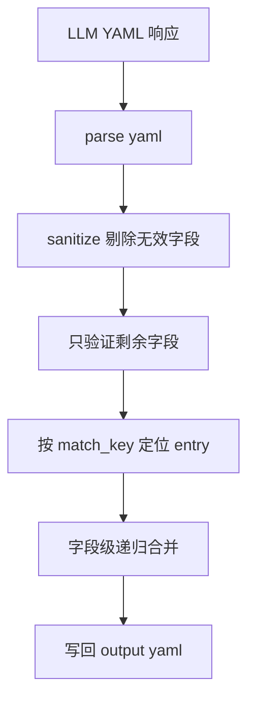

# 验证与更新规则重设计计划

## 目标

将当前基于完整节点输出的严格链路，调整为支持局部字段更新的宽松链路：

- 允许 LLM 返回字段缺失的增量数据
- 在解析后先剔除无效字段
- 验证阶段只验证清理后仍然存在的字段
- 将有效字段合并到同一个 entry 中，而不是整节点覆盖

## 当前现状

- [`SchemaValidator.validate_increment()`](../src/schema_validator.py:23) 目前要求顶层根键存在，并对列表节点做较严格校验。
- [`SchemaValidator._validate_against_skeleton()`](../src/schema_validator.py:71) 目前会对已有字段做结构和类型检查。
- [`YamlStore.merge_increment()`](../src/yaml_store.py:43) 目前对相同 [`match_key`](../src/models.py:106) 的 entry 采用整节点替换，见 [`existing_items[index_by_key[item_key]] = item`](../src/yaml_store.py:68)。
- [`build_output_rules()`](../src/prompt_builder.py:34) 目前仍要求完整节点输出，见 [`每个节点必须是完整节点，不允许只返回局部字段补丁`](../src/prompt_builder.py:39)。
- [`TaskRunner._run_chapter()`](../src/task_runner.py:108) 当前链路是 parse → validate → merge，中间没有独立的清理步骤。

## 新规则定义

### 1. 无效字段清理规则

LLM YAML 响应在解析成功后，先做统一清理。

需要剔除的值：

- 空字符串
- 仅空白字符串
- 空列表
- 空字典
- YAML 的 `~` 对应的 `None`

需要保留的值：

- 数值 `0`
- 布尔 `false`

### 2. 校验规则

校验阶段只验证清理后仍然存在的字段。

具体规则：

- schema 中存在但本次未返回的字段：不验证
- schema 中存在但清理后被删掉的字段：不验证
- 清理后仍然存在的字段：验证其结构和类型
- schema 外字段：继续报错
- 顶层 key 仍需合法
- root key 若存在，则其值必须是列表
- 列表项必须是映射
- 每个需要参与合并的 entry 必须包含非空 [`match_key`](../src/models.py:106)

### 3. 合并规则

对相同 [`match_key`](../src/models.py:106) 的 entry 做字段级合并，而不是整节点替换。

规则如下：

- 标量字段：新值覆盖旧值
- 字典字段：递归合并
- 列表字段：整体替换
- 本次未提供的字段：保留旧值
- 被清理掉而不存在的字段：视为未提供，不触发删除

## 推荐实现位置

### 清理逻辑放置位置

建议在 [`src/schema_validator.py`](../src/schema_validator.py) 中新增独立的 sanitize 逻辑，例如：

- `sanitize_increment_data`
- `sanitize_node`

原因：

- 不污染 [`SchemaValidator.parse_yaml_text()`](../src/schema_validator.py:11) 的纯解析职责
- 不把数据修复职责塞进 [`YamlStore.merge_increment()`](../src/yaml_store.py:43)
- 能保证 [`SchemaValidator.validate_increment()`](../src/schema_validator.py:23) 看到的是最终有效字段

### 编排位置

由 [`TaskRunner._run_chapter()`](../src/task_runner.py:108) 串联整个流程。

目标链路：

1. [`SchemaValidator.parse_yaml_text()`](../src/schema_validator.py:11)
2. sanitize 无效字段
3. [`SchemaValidator.validate_increment()`](../src/schema_validator.py:23)
4. [`YamlStore.merge_increment()`](../src/yaml_store.py:43)
5. 写回 output yaml

## 目标流程图

## 代码改造计划

### 步骤 1：新增 sanitize 能力

文件：[`src/schema_validator.py`](../src/schema_validator.py)

实施内容：

- 新增递归清理入口函数
- 新增递归节点清理函数
- 对字符串执行 trim
- 删除空白字符串、`None`、空列表、空字典
- 保留 `0` 和 `False`
- 清理列表和字典时递归处理子节点

验收标准：

- 输入包含空白字段时，输出只保留有效字段
- 嵌套字典和列表也能正确清理

### 步骤 2：放宽增量校验

文件：[`src/schema_validator.py`](../src/schema_validator.py)

实施内容：

- 调整 [`SchemaValidator.validate_increment()`](../src/schema_validator.py:23)
- 不再要求普通字段必须存在
- 只验证 sanitize 后仍然保留的字段
- 保留对顶层结构、列表项结构、[`match_key`](../src/models.py:106) 的最小约束
- 保留未知字段和类型错误校验

验收标准：

- partial update 可以通过校验
- 缺失普通字段不报错
- 缺失 [`match_key`](../src/models.py:106) 仍报错
- schema 外字段仍报错

### 步骤 3：在主链路接入 sanitize

文件：[`src/task_runner.py`](../src/task_runner.py)

实施内容：

- 在 [`parsed_yaml, parse_result = self.schema_validator.parse_yaml_text(yaml_text)`](../src/task_runner.py:187) 之后增加 sanitize 调用
- 后续 [`SchemaValidator.validate_increment()`](../src/schema_validator.py:23) 和 [`YamlStore.merge_increment()`](../src/yaml_store.py:43) 都改用清理后的数据
- 保证日志和失败路径能反映 sanitize 后的校验结果

验收标准：

- parse 成功后总是先 sanitize 再 validate
- merge 使用的是 sanitize 后的数据

### 步骤 4：改造同一 entry 的合并方式

文件：[`src/yaml_store.py`](../src/yaml_store.py)

实施内容：

- 重写 [`YamlStore.merge_increment()`](../src/yaml_store.py:43) 的同 key 分支
- 新增字段级递归合并 helper
- 相同 [`match_key`](../src/models.py:106) 时不再整节点替换
- 标量覆盖、字典递归、列表整体替换

验收标准：

- 旧 entry 中未被本次返回的字段仍保留
- 新返回的标量字段覆盖旧值
- 嵌套字典按字段递归更新
- 列表字段整体替换

### 步骤 5：调整提示词输出约束

文件：[`src/prompt_builder.py`](../src/prompt_builder.py)

实施内容：

- 修改 [`build_output_rules()`](../src/prompt_builder.py:34)
- 删除要求完整节点返回的约束
- 明确允许只返回新增或更新字段
- 明确不要输出空字符串、空列表、空字典、`~`
- 明确每个 entry 仍必须包含 [`match_key`](../src/models.py:106)

验收标准：

- 提示词和新链路规则一致
- 不再诱导 LLM 返回完整节点

### 步骤 6：补齐测试

文件：[`tests/test_pipeline.py`](../tests/test_pipeline.py)

实施内容：

- 新增 sanitize 相关测试
- 新增 partial update 校验通过测试
- 保留或调整 [`test_validate_increment_rejects_missing_match_key`](../tests/test_pipeline.py:115)
- 修改 [`test_merge_increment_replaces_and_appends_nodes`](../tests/test_pipeline.py:179) 的预期，改为字段级合并
- 新增嵌套字典递归合并测试
- 新增列表整体替换测试

验收标准：

- 新规则有明确自动化覆盖
- 原先依赖整节点替换的断言已同步更新

## Todo 清单

- [ ] 在 [`src/schema_validator.py`](../src/schema_validator.py) 新增 sanitize 逻辑
- [ ] 调整 [`SchemaValidator.validate_increment()`](../src/schema_validator.py:23)，只验证剩余字段
- [ ] 在 [`src/task_runner.py`](../src/task_runner.py) 接入 sanitize → validate → merge 链路
- [ ] 改造 [`YamlStore.merge_increment()`](../src/yaml_store.py:43) 为字段级递归合并
- [ ] 调整 [`build_output_rules()`](../src/prompt_builder.py:34) 的规则文案
- [ ] 更新 [`tests/test_pipeline.py`](../tests/test_pipeline.py) 覆盖新行为

## 实施结论

最终实现口径如下：

先解析 LLM YAML，再剔除无效字段，然后只验证剩余字段，最后按 [`match_key`](../src/models.py:106) 将有效字段递归合并进相同 entry。
